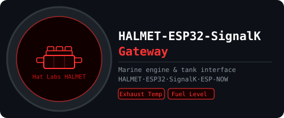
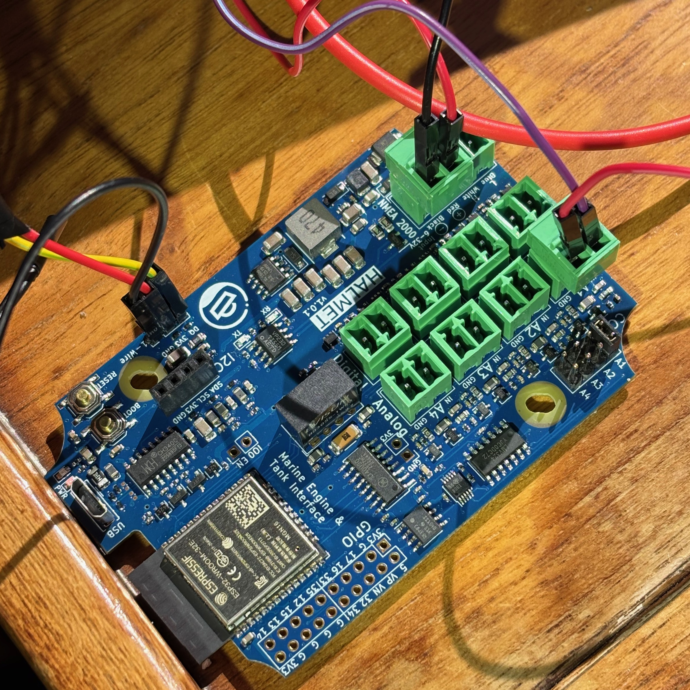
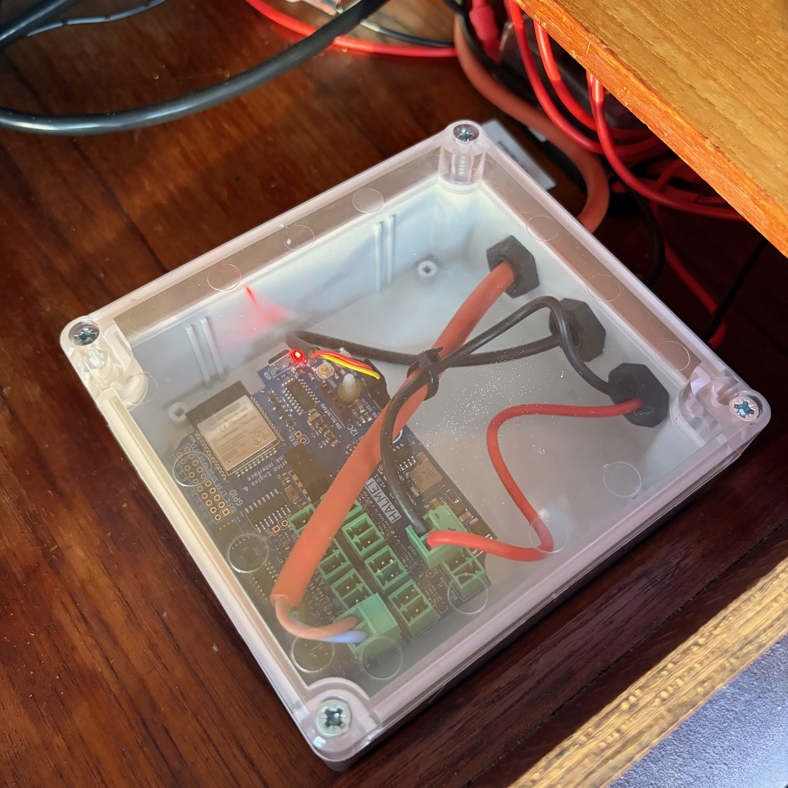

# HALMET-ESP32-SignalK Gateway

[](https://www.espressif.com/en/sdks/esp-arduino)
[](https://docs.hatlabs.fi/halmet/)
[](https://signalk.org)
[](https://github.com/gilmaimon/ArduinoWebsockets)
[](https://www.espressif.com/en/solutions/low-power-solutions/esp-now)
[](LICENSE)

ESP32-based gateway for [Hat Labs HALMET](https://docs.hatlabs.fi/halmet/) (Marine Engine & Tank Interface) board. Reads exhaust temperature via a DS18B20 1-Wire sensor, fuel tank level via a VDO European resistive sender, and fresh water tank level via a second resistive sender — both through the onboard ADS1115 ADC. Sends readings to a [SignalK](https://signalk.org) server via WebSocket/JSON and broadcasts them to other ESP32 devices via ESP-NOW.

OTA firmware updates are enabled. A read-only calibration/debug web page is included for measuring sender resistance during tank calibration; it is compiled out by default (`WEB_UI_ENABLED = false`) and is enabled only while calibrating. Persistent configuration storage (NVS) is skeleton-implemented and reserved for future use.

Developed and tested on:
- [Hat Labs HALMET](https://docs.hatlabs.fi/halmet/) (ESP32-WROOM-32E, 16 MB flash)
- [ESP32 board package](https://github.com/espressif/arduino-esp32) (3.3.7)
- [Arduino IDE](https://www.arduino.cc/en/software/) (2.3.8)
- SignalK Server (2.23.0)
- DS18B20 1-Wire temperature sensor (exhaust)
- Wema/VDO European resistive fuel sender (3-180 Ω, low resistance = empty)
- Resistive fresh water sender (nominal 0-180 Ω, low resistance = empty)

Integrated via ESP-NOW to:
- [ESP32-Crowpanel-compass](https://github.com/mkvesala/ESP32-Crowpanel-compass)

## Purpose of the project

This is one of my individual digital boat projects. Use at your own risk. Not for safety-critical operations.

1. I needed engine exhaust temperature, fuel tank level and fresh water tank level available in SignalK and on the vessel's ESP-NOW peer-to-peer network
2. The HALMET board provides galvanically isolated analog inputs with a built-in constant current source, making it well suited for resistive senders without an external gauge
3. I wanted to continue building on the ESP32 gateway design pattern established in previous projects

## Release history

| Release | Branch | Comment |
|---------|--------|---------|
| v1.3.0 | main | Latest release. Fresh water tank level via a second resistive sender on A2, using a measured calibration table for the irregularly shaped tank. Adds a read-only calibration/debug web page (`WEB_UI_ENABLED`, off by default) that replaces the serial monitor while measuring the table. |
| v1.2.0 | main | WebSocket client recreated per reconnect to fix permanent reconnect failure after prolonged uptime. |
| v1.1.0 | main | WebSocket ping/pong liveness + graceful reconnect (half-open TCP detection). |
| v1.0.0 | main | Initial release. DS18B20 exhaust temperature, VDO fuel level, SignalK WebSocket, ESP-NOW broadcast. |

## Classes

Class diagram including the companion projects:


**`DS18B20Sensor`:**
- Owns: `OneWire`, `DallasTemperature`
- Owned by: `HALMETApplication`
- Responsible for: raw 1-Wire I/O on GPIO4; `requestAndRead()` blocks ~750 ms and must be called only from a dedicated FreeRTOS task

**`DS18B20Processor`:**
- Owns: `ExhaustTempDelta` (data struct), `portMUX_TYPE` spinlock
- Uses: `DS18B20Sensor`
- Owned by: `HALMETApplication`
- Responsible for: converting raw °C to Kelvin and exposing a thread-safe delta struct (FreeRTOS task writes, main loop reads)

**`VDOSensor`:**
- Owns: `Adafruit_ADS1115`
- Owned by: `HALMETApplication`
- Responsible for: reading ADS1115 channel 0 and converting the measured voltage to sender resistance in ohms (CCS mode: V = R × 1 mA; HALMET hardware measured at 1 mA despite Hat Labs documentation stating 10 mA)

**`VDOProcessor`:**
- Owns: `FuelLevelDelta` (data struct), 120-sample circular buffer
- Uses: `VDOSensor`
- Owned by: `HALMETApplication`
- Responsible for: three-phase filtering pipeline (raw → median 120 → EMA α=0.005) and linear mapping of sender resistance to fill ratio; see `docs/fuel_level_filtering.md`

**`WaterSensor`:**
- Owns: `Adafruit_ADS1115` (its own instance — the driver holds no channel state, and both analog sensors are read sequentially from the main loop)
- Owned by: `HALMETApplication`
- Responsible for: reading ADS1115 channel 1 (input A2) and converting the measured voltage to sender resistance in ohms. Unlike `VDOSensor` it accepts 0 Ω as a valid empty reading and guards the open-circuit fault case with a high-side `MAX_OHMS` instead

**`WaterProcessor`:**
- Owns: `WaterLevelDelta` (data struct), `WaterCal` calibration table, 60-sample circular buffer
- Uses: `WaterSensor`
- Owned by: `HALMETApplication`
- Responsible for: three-phase filtering pipeline (raw → median 60 → EMA α=0.04) and piecewise-linear mapping of sender resistance to fill ratio through the measured calibration table, since the tank is irregularly shaped; see `docs/water_level_calibration.md`

**`HALMETPreferences`:**
- Owns: `Preferences`
- Uses: `DS18B20Processor`, `VDOProcessor`, `WaterProcessor`
- Owned by: `HALMETApplication`
- Responsible for: loading and saving data to ESP32 NVS — *skeleton, not implemented in this version*

**`SignalKBroker`:**
- Owns: `WebsocketsClient` (via `std::unique_ptr`, recreated fresh on every reconnect)
- Uses: `DS18B20Processor`, `VDOProcessor`, `WaterProcessor`
- Owned by: `HALMETApplication`
- Responsible for: WebSocket connection and delta transmission to SignalK server; active ping/pong liveness (`ping()` / `isStale()`) for half-open TCP detection

**`ESPNowBroker`:**
- Uses: `DS18B20Processor`, `VDOProcessor`, `WaterProcessor`
- Owned by: `HALMETApplication`
- Responsible for: ESP-NOW broadcast of engine, fuel tank and fresh water tank data

**`WebUIManager`:**
- Owns: `WebServer`
- Uses: `DS18B20Processor`, `VDOProcessor`, `WaterProcessor`, `HALMETPreferences`, `SignalKBroker`
- Owned by: `HALMETApplication`
- Responsible for: HTTP calibration/debug page (`/`, `/status`, `/cal`) — read-only, no authentication, gated by `HALMETApplication::WEB_UI_ENABLED`, which ships as `false` so the page is compiled out of a production build. Reachable over the STA interface only.

**`HALMETApplication`:**
- Owns: `DS18B20Sensor`, `DS18B20Processor`, `VDOSensor`, `VDOProcessor`, `WaterSensor`, `WaterProcessor`, `HALMETPreferences`, `SignalKBroker`, `ESPNowBroker`, `WebUIManager`
- Uses: `WifiState`
- Responsible for: orchestrating everything within the main program; manages the DS18B20 FreeRTOS task, WiFi state machine, and all loop timers

**`WifiState`:**
- Global enum class for WiFi states maintained and shared by `HALMETApplication`

## Features

### Sensor reading

**Exhaust temperature (DS18B20):**
1. A dedicated FreeRTOS task reads the DS18B20 every ~1 s; the 750 ms conversion blocks the task, never the main loop
2. Thread-safe transfer to the main loop via `portMUX_TYPE` spinlock
3. Converted to Kelvin before transmission

**Fuel level (VDO sender + ADS1115):**
1. ADS1115 channel 0 is sampled every 2 s in the main loop
2. The HALMET constant current source (1 mA, CCS jumper on input A1) allows direct resistance measurement: R = V / 1 mA. Note: Hat Labs documentation states 10 mA but hardware measurement confirms 1 mA.
3. Resistance is mapped linearly to fill ratio: 3 Ω = empty, 180 Ω = full (Wema/VDO European sender — resistance rises with fill level)
4. Three-phase filtering pipeline eliminates wave-induced noise (signal/noise ratio in a single raw sample is ~1:50 000):
   - **Phase 1 (0-4 min):** median window filling — raw resistance sent immediately so data flows from boot
   - **Phase 2 (4 min):** EMA initialized to the first median value — no warm-up ramp
   - **Phase 3 (4 min →):** normal operation: median(120) → EMA(α=0.005) → fill ratio

See `docs/fuel_level_filtering.md` for full design rationale and parameter derivation.

**Fresh water level (resistive sender + ADS1115):**
1. ADS1115 channel 1 is sampled every ~2 s in the main loop, on a timer deliberately offset from the fuel read so the two ADC conversions drift apart rather than phase-locking
2. Same constant current source principle as the fuel sender, with the CCS jumper on input A2
3. The tank is **irregularly shaped**, so resistance is mapped through a **measured calibration table** (`WaterCal::OHMS`) rather than linearly: the tank is drained in 5 L steps and the settled sender resistance recorded against volume, on a 2.5 L table grid (33 rows, 0-80 L) whose row index carries the volume, with piecewise-linear interpolation between points. Readings outside the calibrated range clamp rather than extrapolate, and the table is validated at compile time by a `static_assert`
4. Same three-phase filtering pipeline as fuel, but tuned much faster — median(60) → EMA(α=0.04, τ ≈ 50 s), ~2.5 min settle instead of ~20 min. Fuel burns continuously at a few litres per hour, but water draw is bursty: a shower can take 15 % of the tank in minutes, and a gauge lagging 20 minutes behind would be useless for deciding whether to refill

Unlike the fuel sender, a reading of 0 Ω is treated as a **valid empty tank** rather than a failed read — rejecting low readings would freeze the reported level exactly when the tank is about to run dry. The fault case guarded against is instead an open circuit, which the constant current source drives to the rail.

See `docs/water_level_calibration.md` for the calibration procedure and filter rationale.

### SignalK communication

Connects to:
```
ws://<server>:<port>/signalk/v1/stream?token=<optional>
```

**Sends** unconditionally on independent fixed-interval timers (no deadband — every path is refreshed often enough that SignalK never sees it as stale):

| SignalK path | Unit | Frequency | Source |
|---|---|---|---|
| `propulsion.0.exhaustTemperature` | Kelvin | ~1 s | DS18B20 |
| `tanks.fuel.0.currentLevel` | ratio 0-1 | ~3 s | VDO/ADS1115 |
| `tanks.freshWater.0.currentLevel` | ratio 0-1 | ~4 s | Water sender/ADS1115 |
| `tanks.fuel.0.capacity` | m³ | once, on first poll cycle after connect | static (0.4 m³) |
| `tanks.freshWater.0.capacity` | m³ | once, on first poll cycle after connect | static (0.08 m³) |

Both capacities travel as two entries in a single delta, so one `_capacity_sent` flag governs both.

Source name is auto-derived from the device MAC address: `esp32.halmet-XXYYZZ`.

WebSocket reconnects automatically with exponential back-off starting at ~2 s, doubling on each failed attempt up to a ceiling of ~120 s, and resetting to the initial interval when the connection is restored. Each reconnect builds a brand-new `WebsocketsClient` (held via `std::unique_ptr`) and destroys the previous one, so every attempt starts from a clean TCP / lwIP socket state; this prevents a stuck underlying socket from making all future reconnects fail permanently until a reboot.

**Connection liveness (ping/pong):** while the socket is open the device sends a WebSocket ping every ~10 s and tracks the server's pong. If no pong arrives within ~30 s the connection is considered dead — even when `isOpen()` still reports `true`, as with a half-open TCP connection (e.g. the SignalK host freezing the link under power-saving) — and the socket is closed so the exponential back-off reconnects it. Recovery is transport-only; the device does not reboot.

### ESP-NOW communication

Broadcasts sensor data via ESP-NOW for other ESP32 devices, such as external displays (e.g. ESP32-Crowpanel-compass).

**Sends** unconditionally at ~3 s frequency (no deadband — caller controls the interval):
- `HALMETEngineDelta` struct containing:
  - `exhaust_temp_k` — exhaust temperature in Kelvin
- `HALMETTankDelta` struct containing:
  - `fuel_level_ratio` — fuel level ratio 0.0-1.0
- `HALMETWaterDelta` struct containing:
  - `water_level_ratio` — fresh water level ratio 0.0-1.0

New sensors get a new `ESPNowMsgType` value and their own payload struct rather than extra fields on an existing one, so already-deployed receivers keep decoding the old structs correctly and need no reflash.

**Broadcast mode:** Uses broadcast address (FF:FF:FF:FF:FF:FF) — any ESP-NOW receiver on the same WiFi channel can listen.

**WiFi coexistence:** ESP-NOW operates alongside WiFi (AP_STA mode). Both SignalK WebSocket and ESP-NOW broadcast function simultaneously.

**Receives:** incoming command processing stub is present; no commands are handled in this version.

**Note: ESP-NOW receivers must be on the same WiFi channel as this device. The simplest approach is to connect both devices to the same WiFi network with a fixed channel.**

### WiFi and OTA

- WiFi state machine: `INIT → CONNECTING → CONNECTED`, with a ~90-second connection timeout and automatic fallback to `OFF` on failure or missing SSID
- **Static IP** — the device configures a fixed address via `WiFi.config()` (`WIFI_STATIC_IP` / `WIFI_GATEWAY` / `WIFI_SUBNET` in `secrets.h`), applied at boot and reapplied after every reconnect, since `WiFi.disconnect(true)` does not preserve the static configuration. Pick an address outside your router's DHCP pool.
- **Hardened reconnect** — on connection loss, the WebSocket is closed and the STA interface is fully torn down (`WiFi.disconnect(true)` + 200 ms settle + `WiFi.setSleep(false)` + static IP reapplied) before reconnecting, instead of a bare disconnect/begin cycle that can leave the radio stuck or the WebSocket stale
- ArduinoOTA enabled immediately after WiFi connects; hostname is set to the SignalK source name

### WiFi AP security

ESP-NOW requires `WIFI_AP_STA` mode, which opens an AP interface on the ESP32. The AP is not intended for external clients and is hardened with three lines of defence:

1. **Hidden SSID** — the AP is not advertised (`ssid_hidden=1`); it cannot be discovered by passive scanning
2. **WPA2 password** — the AP requires a passphrase (`AP_PASS` in `secrets.h`, minimum 8 characters); the network is inaccessible without it
3. **Intrusion detection** — if a client connects despite the above, it is deauthenticated immediately via `esp_wifi_deauth_sta()`; the intruder's MAC address is logged to Serial

## Project structure

| File(s) | Description |
|---------|-------------|
| `HALMET-ESP32-SignalK-gateway.ino` | Owns `HALMETApplication app`, contains `setup()` and `loop()` |
| `secrets.example.h` | Example credentials. Rename to `secrets.h` and populate with your credentials. |
| `version.h` | Software version |
| `WifiState.h` | Enum class for WiFi states |
| `espnow_protocol.h` | Shared ESP-NOW wire protocol — header, packet template, all payload structs |
| `helpers.h` | `validf()` float validator |
| `DS18B20Sensor.h / .cpp` | Class `DS18B20Sensor` — 1-Wire raw I/O |
| `DS18B20Processor.h / .cpp` | Class `DS18B20Processor` — °C → K conversion, thread-safe delta |
| `VDOSensor.h / .cpp` | Class `VDOSensor` — ADS1115 resistance measurement |
| `VDOProcessor.h / .cpp` | Class `VDOProcessor` — median + EMA filtering, fill ratio |
| `WaterSensor.h / .cpp` | Class `WaterSensor` — ADS1115 resistance measurement (channel 1) |
| `WaterProcessor.h / .cpp` | Class `WaterProcessor` — calibration table, median + EMA filtering, fill ratio |
| `HALMETPreferences.h / .cpp` | Class `HALMETPreferences` — NVS skeleton |
| `SignalKBroker.h / .cpp` | Class `SignalKBroker` |
| `ESPNowBroker.h / .cpp` | Class `ESPNowBroker` |
| `WebUIManager.h / .cpp` | Class `WebUIManager` — HTTP calibration/debug page |
| `HALMETApplication.h / .cpp` | Class `HALMETApplication`, the "app" |
| `docs/fuel_level_filtering.md` | Fuel level filter design rationale and parameter derivation |
| `docs/water_level_calibration.md` | Fresh water tank calibration procedure and filter rationale |

## Hardware

### HALMET board

The [Hat Labs HALMET](https://docs.hatlabs.fi/halmet/) (Marine Engine & Tank Interface) provides:
- ESP32-WROOM-32E (16 MB flash)
- 4 galvanically isolated analog inputs (A1-A4) via ADS1115 16-bit I2C ADC at 0x4B (ADDR pin tied to SCL on HALMET board)
- Optional constant current source (1 mA measured; Hat Labs documentation states 10 mA) per analog input via solder jumper
- 4 galvanically isolated digital inputs (DI1-DI4)
- 1-Wire header on GPIO4
- 5-32 V power input

**Arduino IDE board setting: `ESP32 Dev Module`** (not SH-ESP32 — pin assignments differ).

### Sensors used in this project

| Sensor | Connection | HALMET header |
|--------|-----------|---------------|
| DS18B20 temperature | 1-Wire | 1-Wire header (GPIO4) |
| VDO resistive fuel sender | Resistive, 3-180 Ω | Analog input A1 (CCS jumper enabled) |
| Fresh water resistive sender | Resistive, nominal 0-180 Ω | Analog input A2 (CCS jumper enabled) |

### Bill of materials

1. Hat Labs HALMET board
2. DS18B20 1-Wire temperature sensor (waterproof probe recommended for exhaust)
3. Wema/VDO European resistive fuel sender (3 Ω = empty, 180 Ω = full)
4. Resistive fresh water sender (nominal 0-180 Ω, low resistance = empty)
5. Wiring
6. 12 V DC power supply (from vessel's electrical system)
7. WiFi router providing wireless LAN AP
8. SignalK server running in LAN

**No paid partnerships.**

## Software used

1. Arduino IDE 2.3.8
2. Espressif Systems esp32 board package 3.3.7
3. Additional libraries installed via Arduino Library Manager:
   - Adafruit ADS1X15 (by Adafruit)
   - OneWire (by Paul Stoffregen)
   - DallasTemperature (by Miles Burton)
   - ArduinoWebsockets (by Gil Maimon, version 0.5.4)
   - ArduinoJson (by Benoit Blanchon, version 7.4.3)

## Installation

1. Clone the repo
   ```
   git clone https://github.com/mkvesala/HALMET-ESP32-SignalK-gateway.git
   ```
2. Alternatively, download the code as zip
3. Set up your credentials in `secrets.h` (first by renaming `secrets.example.h` to `secrets.h`)
   ```cpp
   inline constexpr const char* WIFI_SSID            = "your_wifi_ssid_here";
   inline constexpr const char* WIFI_PASS            = "your_wifi_password_here";
   inline constexpr const char* WIFI_STATIC_IP       = "192.168.1.50"; // pick an address outside your router's DHCP pool
   inline constexpr const char* WIFI_GATEWAY         = "192.168.1.1";
   inline constexpr const char* WIFI_SUBNET          = "255.255.255.0";
   inline constexpr const char* SK_HOST              = "your_signalk_address_here";
   inline constexpr uint16_t    SK_PORT              = 3000; // replace with your SignalK server port
   inline constexpr const char* SK_TOKEN             = "your_signalk_auth_token_here";
   inline constexpr const char* OTA_PASS             = "your_OTA_password_here";
   inline constexpr const char* DEFAULT_WEB_PASSWORD = "your_default_web_password_here";
   inline constexpr const char* AP_SSID              = "your_ap_ssid_here";   // hidden, name not critical
   inline constexpr const char* AP_PASS              = "your_ap_password_here"; // min 8 chars (WPA2)
   ```
4. **Make sure that `secrets.h` is listed in your `.gitignore` file**
5. Enable the CCS jumper on the HALMET board for analog inputs A1 (VDO fuel sender) and A2 (fresh water sender)
6. Connect the DS18B20 to the HALMET 1-Wire header (GPIO4). The HALMET board has a built-in pull-up resistor on the 1-Wire line — no external pull-up is needed. Verify wiring against the HALMET schematic; incorrect wiring (e.g. swapped VCC/GND) will prevent the device from booting.
7. Connect the VDO sender signal wire to HALMET analog input A1; connect sender ground to HALMET GND
8. Connect the fresh water sender signal wire to HALMET analog input A2; connect sender ground to HALMET GND
9. Connect and power up the HALMET board
10. Compile and upload with Arduino IDE (board: `ESP32 Dev Module`, required libraries installed)
11. The fresh water tank is calibrated for Frida's 80 L tank — see `docs/water_level_calibration.md`. Note that `currentLevel` never exceeds ~0.957 and the 57.5-80 L range is not resolvable; both are sender limits, not bugs.

## Security

### Maritime navigation

**Use at your own risk — not for safety-critical operations!**

### Important security considerations

1. **HTTP only (No HTTPS)**
   - Use only on private, trusted networks

2. **LAN deployment only**
   - Do NOT expose to public internet
   - Keep ESP32 on isolated WiFi
   - Use WPA2/WPA3 encryption

3. **SignalK token visibility**
   - SignalK authentication token is visible in the WebSocket URL
   - Keep HALMET and SignalK server on the same private network

4. **`secrets.h`**
   - Make sure that `secrets.h` is listed in your `.gitignore` file

5. **WiFi AP interface**
   - The AP interface is required for ESP-NOW and is hardened automatically (hidden SSID, WPA2, immediate deauth on intrusion — see [WiFi AP security](#wifi-ap-security))
   - Set a strong `AP_PASS` (minimum 8 characters) in `secrets.h`

### Deployment

**Recommended:**
- Deploy on private isolated boat WiFi
- Use WPA2/WPA3 WiFi encryption

**Not recommended:**
- Public internet exposure
- Port forwarding to HALMET
- Sharing WiFi network with untrusted devices

## Credits

Developed and tested using HW and SW described in this README file.

Developed by Matti Vesala in collaboration with Claude (Anthropic).

This is a companion project to my [CMPS14-ESP32-SignalK-gateway](https://github.com/mkvesala/CMPS14-ESP32-SignalK-gateway), [VEDirect-ESP32-SignalK-gateway](https://github.com/mkvesala/VEDirect-ESP32-SignalK-gateway), [BME280-ESP32-SignalK-gateway](https://github.com/mkvesala/BME280-ESP32-SignalK-gateway), [UBLOX-ESP32-SignalK-gateway](https://github.com/mkvesala/UBLOX-ESP32-SignalK-gateway) and [ESP32-Crowpanel-compass](https://github.com/mkvesala/ESP32-Crowpanel-compass). Check the UML diagram to see how these projects relate:


## Gallery

  
